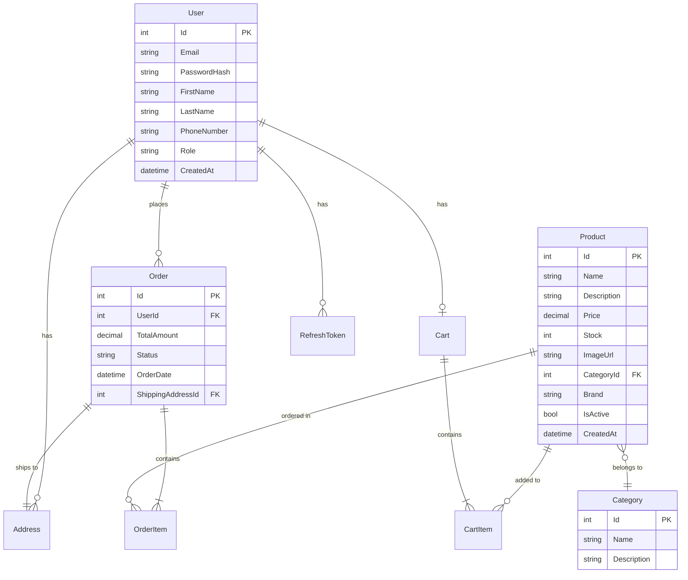

# ANALISI TECNICA
## Progetto Audio Store E-Commerce

**Versione:** 1.0  
**Data:** 27 Gennaio 2026  
**Redatto da:** Senior Analista Progettuale  
**Cliente:** Audio Store  

---

## 1. INTRODUZIONE

### 1.1 Scopo del Documento
Il presente documento di Analisi Tecnica rappresenta la fase successiva all'Analisi Funzionale e precede lo sviluppo del sistema e-commerce Audio Store. Definisce l'architettura software, le tecnologie, i pattern di progettazione e le specifiche tecniche necessarie per l'implementazione del sistema.

### 1.2 Riferimenti
- **Analisi Funzionale:** Audio Store - Analisi Funzionale v1.0
- **Standard di Riferimento:** Clean Architecture, Domain-Driven Design (DDD)
- **Framework:** ASP.NET Core 10.0, Angular 21

### 1.3 Glossario Tecnico
- **API:** Application Programming Interface
- **JWT:** JSON Web Token
- **ORM:** Object-Relational Mapping
- **SPA:** Single Page Application
- **CORS:** Cross-Origin Resource Sharing
- **DI:** Dependency Injection

---

## 2. ARCHITETTURA DEL SISTEMA

### 2.1 Architettura Generale

Il sistema Audio Store adotta un'architettura **Client-Server** con separazione netta tra Frontend e Backend:

```
┌─────────────────────────────────────────────────────────────┐
│                    FRONTEND (Angular 21)                     │
│                   Single Page Application                    │
│                    http://localhost:4200                     │
└──────────────────────────┬──────────────────────────────────┘
                           │
                           │ HTTP/HTTPS + JSON
                           │ REST API
                           │
┌──────────────────────────▼──────────────────────────────────┐
│                 BACKEND (ASP.NET Core 10.0)                  │
│                      Web API RESTful                         │
│                    http://localhost:5000                     │
└──────────────────────────┬──────────────────────────────────┘
                           │
                           │ Entity Framework Core
                           │
┌──────────────────────────▼──────────────────────────────────┐
│                  DATABASE (SQL Server)                       │
│              Relational Database Management                  │
└─────────────────────────────────────────────────────────────┘
```

### 2.2 Pattern Architetturale: Clean Architecture

Il Backend implementa la **Clean Architecture** con separazione in layer concentrici:

```
┌───────────────────────────────────────────────────────────┐
│                    AudioStore.Api                          │
│              (Presentation Layer - Controllers)            │
└─────────────────────────┬─────────────────────────────────┘
                          │
┌─────────────────────────▼─────────────────────────────────┐
│                 AudioStore.Application                     │
│         (Business Logic - Services, DTOs, Validators)      │
└─────────────────────────┬─────────────────────────────────┘
                          │
┌─────────────────────────▼─────────────────────────────────┐
│                AudioStore.Infrastructure                   │
│    (Data Access - Repositories, DbContext, Identity)       │
└─────────────────────────┬─────────────────────────────────┘
                          │
┌─────────────────────────▼─────────────────────────────────┐
│                   AudioStore.Domain                        │
│           (Core - Entities, Interfaces, Exceptions)        │
└───────────────────────────────────────────────────────────┘
```

**Vantaggi:**
- ✅ Indipendenza dal framework
- ✅ Testabilità elevata
- ✅ Indipendenza dal database
- ✅ Manutenibilità e scalabilità

---

## 3. SPECIFICHE TECNICHE BACKEND

### 3.1 Stack Tecnologico

| Componente | Tecnologia | Versione |
|------------|------------|----------|
| **Framework** | ASP.NET Core | 10.0 |
| **Linguaggio** | C# | 13.0 |
| **ORM** | Entity Framework Core | 10.0.2 |
| **Database** | SQL Server | 2022+ |
| **Autenticazione** | JWT + ASP.NET Identity | 10.0.2 |
| **Logging** | Serilog | 10.0.0 |
| **Validazione** | FluentValidation | 12.1.1 |
| **API Versioning** | Asp.Versioning.Mvc | 8.1.1 |
| **Documentazione API** | Swagger/OpenAPI | 6.9.0 |
| **Caching** | In-Memory Cache | - |

### 3.2 Struttura dei Layer

#### 3.2.1 AudioStore.Domain (Core Layer)

**Responsabilità:** Contiene la logica di business pura e le entità del dominio.

**Componenti Principali:**

```
AudioStore.Domain/
├── Entities/
│   ├── BaseEntity.cs          # Classe base con Id, CreatedAt, UpdatedAt
│   ├── User.cs                # Entità utente (eredita IdentityUser)
│   ├── Product.cs             # Prodotto audio
│   ├── Category.cs            # Categoria prodotti
│   ├── Order.cs               # Ordine cliente
│   ├── OrderItem.cs           # Riga ordine
│   ├── Cart.cs                # Carrello
│   ├── CartItem.cs            # Elemento carrello
│   ├── Address.cs             # Indirizzo spedizione
│   └── RefreshToken.cs        # Token di refresh JWT
├── Interfaces/
│   ├── IRepository<T>.cs      # Repository generico
│   └── IUnitOfWork.cs         # Pattern Unit of Work
└── Exceptions/
    └── DomainException.cs     # Eccezioni custom del dominio
```

**Entità Principali:**

**Product:**
```csharp
public class Product : BaseEntity
{
    public string Name { get; set; }
    public string Description { get; set; }
    public decimal Price { get; set; }
    public int Stock { get; set; }
    public string ImageUrl { get; set; }
    public int CategoryId { get; set; }
    public Category Category { get; set; }
    public string Brand { get; set; }
    public bool IsActive { get; set; }
}
```

**Order:**
```csharp
public class Order : BaseEntity
{
    public int UserId { get; set; }
    public User User { get; set; }
    public decimal TotalAmount { get; set; }
    public OrderStatus Status { get; set; }
    public DateTime OrderDate { get; set; }
    public Address ShippingAddress { get; set; }
    public ICollection<OrderItem> OrderItems { get; set; }
}
```

#### 3.2.2 AudioStore.Application (Business Logic Layer)

**Responsabilità:** Orchestrazione della logica di business, validazione, mapping.

```
AudioStore.Application/
├── Services/
│   ├── Interfaces/
│   │   ├── IAuthService.cs
│   │   ├── IProductService.cs
│   │   ├── IOrderService.cs
│   │   ├── ICartService.cs
│   │   └── ICategoryService.cs
│   └── Implementations/
│       ├── AuthService.cs
│       ├── ProductService.cs
│       ├── OrderService.cs
│       ├── CartService.cs
│       └── CategoryService.cs
├── Commands/                   # CQRS Commands
│   ├── CreateOrderCommand.cs
│   └── UpdateProductCommand.cs
├── Validators/                 # FluentValidation
│   ├── LoginDtoValidator.cs
│   ├── RegisterDtoValidator.cs
│   └── CreateProductDtoValidator.cs
├── Mapping/
│   └── MappingProfile.cs      # AutoMapper profiles
└── Behaviors/
    └── ValidationBehavior.cs  # Pipeline behaviors
```

**Servizi Principali:**

- **AuthService:** Gestione autenticazione, registrazione, login, refresh token
- **ProductService:** CRUD prodotti, filtri, ricerca, paginazione
- **OrderService:** Creazione ordini, gestione stati, storico
- **CartService:** Gestione carrello guest e utenti autenticati
- **CategoryService:** Gestione categorie prodotti

#### 3.2.3 AudioStore.Infrastructure (Data Access Layer)

**Responsabilità:** Accesso ai dati, implementazione repository, configurazioni EF Core.

```
AudioStore.Infrastructure/
├── Data/
│   ├── AppDbContext.cs
│   └── Configurations/         # Entity Type Configurations
│       ├── ProductConfiguration.cs
│       ├── OrderConfiguration.cs
│       ├── UserConfiguration.cs
│       └── CategoryConfiguration.cs
├── Repositories/
│   ├── Repository<T>.cs       # Repository generico
│   └── UnitOfWork.cs          # Implementazione UoW
├── Identity/
│   ├── ApplicationRole.cs
│   ├── RoleSeeder.cs
│   └── IdentityConfiguration.cs
├── Caching/
│   └── CacheService.cs
└── Security/
    └── JwtTokenGenerator.cs
```

**Configurazione Database:**

```csharp
public class AppDbContext : IdentityDbContext<User, ApplicationRole, int>
{
    public DbSet<Product> Products { get; set; }
    public DbSet<Category> Categories { get; set; }
    public DbSet<Order> Orders { get; set; }
    public DbSet<OrderItem> OrderItems { get; set; }
    public DbSet<Cart> Carts { get; set; }
    public DbSet<CartItem> CartItems { get; set; }
    public DbSet<Address> Addresses { get; set; }
    public DbSet<RefreshToken> RefreshTokens { get; set; }
}
```

#### 3.2.4 AudioStore.Api (Presentation Layer)

**Responsabilità:** Esposizione API RESTful, gestione richieste HTTP.

```
AudioStore.Api/
├── Controllers/
│   ├── AuthController.cs          # POST /api/auth/login, /register
│   ├── ProductsController.cs      # GET, POST, PUT, DELETE /api/products
│   ├── CategoriesController.cs    # GET /api/categories
│   ├── CartController.cs          # GET, POST, DELETE /api/cart
│   ├── OrdersController.cs        # GET, POST /api/orders
│   ├── ProfileController.cs       # GET, PUT /api/profile
│   └── AdminController.cs         # Admin endpoints
├── Middleware/
│   └── ExceptionHandlingMiddleware.cs
├── Filters/
│   └── ValidationFilter.cs
└── Extensions/
    └── ServiceExtensions.cs
```

### 3.3 Sicurezza

#### 3.3.1 Autenticazione JWT

**Flusso di Autenticazione:**

```
1. Client → POST /api/auth/login {email, password}
2. Server → Valida credenziali con Identity
3. Server → Genera Access Token (JWT) + Refresh Token
4. Server → Response {accessToken, refreshToken, user}
5. Client → Salva token in localStorage
6. Client → Ogni richiesta include: Authorization: Bearer {token}
```

**Configurazione JWT:**
- **Algoritmo:** HS256
- **Durata Access Token:** 60 minuti
- **Durata Refresh Token:** 7 giorni
- **Claims:** UserId, Email, Role (Admin/Customer)

#### 3.3.2 Autorizzazione basata su Ruoli

**Ruoli Definiti:**
- **Admin:** Accesso completo (CRUD prodotti, gestione ordini, statistiche)
- **Customer:** Accesso limitato (visualizzazione, carrello, ordini personali)

**Implementazione:**
```csharp
[Authorize(Roles = "Admin")]
[HttpPost("products")]
public async Task<IActionResult> CreateProduct(CreateProductDto dto)
```

### 3.4 API Endpoints

#### Autenticazione
| Metodo | Endpoint | Descrizione | Auth |
|--------|----------|-------------|------|
| POST | `/api/auth/register` | Registrazione utente | No |
| POST | `/api/auth/login` | Login utente | No |
| POST | `/api/auth/refresh-token` | Rinnovo token | No |
| POST | `/api/auth/logout` | Logout | Sì |

#### Prodotti
| Metodo | Endpoint | Descrizione | Auth |
|--------|----------|-------------|------|
| GET | `/api/products` | Lista prodotti (paginata) | No |
| GET | `/api/products/{id}` | Dettaglio prodotto | No |
| POST | `/api/products` | Crea prodotto | Admin |
| PUT | `/api/products/{id}` | Aggiorna prodotto | Admin |
| DELETE | `/api/products/{id}` | Elimina prodotto | Admin |

#### Carrello
| Metodo | Endpoint | Descrizione | Auth |
|--------|----------|-------------|------|
| GET | `/api/cart` | Visualizza carrello | Sì |
| POST | `/api/cart/items` | Aggiungi al carrello | Sì |
| PUT | `/api/cart/items/{id}` | Aggiorna quantità | Sì |
| DELETE | `/api/cart/items/{id}` | Rimuovi dal carrello | Sì |

#### Ordini
| Metodo | Endpoint | Descrizione | Auth |
|--------|----------|-------------|------|
| GET | `/api/orders` | Storico ordini utente | Sì |
| GET | `/api/orders/{id}` | Dettaglio ordine | Sì |
| POST | `/api/orders` | Crea ordine | Sì |
| GET | `/api/admin/orders` | Tutti gli ordini | Admin |
| PUT | `/api/admin/orders/{id}/status` | Cambia stato | Admin |

---

## 4. SPECIFICHE TECNICHE FRONTEND

### 4.1 Stack Tecnologico

| Componente | Tecnologia | Versione |
|------------|------------|----------|
| **Framework** | Angular | 21.0.6 |
| **Linguaggio** | TypeScript | 5.9.2 |
| **Styling** | TailwindCSS | 3.4.17 |
| **State Management** | Angular Signals | Built-in |
| **HTTP Client** | HttpClient | Built-in |
| **Routing** | Angular Router | Built-in |
| **Forms** | Reactive Forms | Built-in |
| **Build Tool** | Angular CLI | 21.0.4 |

### 4.2 Architettura Frontend: Feature-Based

```
src/app/
├── core/                       # Singleton services
│   ├── guards/
│   │   ├── auth.guard.ts      # Protegge rotte autenticate
│   │   └── admin.guard.ts     # Protegge rotte admin
│   ├── interceptors/
│   │   ├── jwt.interceptor.ts # Aggiunge JWT header
│   │   └── error.interceptor.ts
│   └── services/
│       └── local-storage.service.ts
│
├── shared/                     # Componenti riutilizzabili
│   ├── components/
│   │   ├── product-card/
│   │   ├── paginator/
│   │   └── breadcrumb/
│   └── ui/                    # Design System
│
├── features/                   # Bounded Contexts
│   ├── auth/
│   │   ├── components/
│   │   │   ├── login-form/
│   │   │   └── register-form/
│   │   ├── services/
│   │   │   └── auth-api.service.ts
│   │   └── state/
│   │       └── auth.store.ts
│   │
│   ├── catalog/
│   │   ├── components/
│   │   │   ├── product-list/
│   │   │   └── product-detail/
│   │   ├── services/
│   │   │   └── catalog-api.service.ts
│   │   └── state/
│   │       └── catalog.store.ts
│   │
│   ├── cart/
│   │   ├── components/
│   │   │   ├── cart-page/
│   │   │   └── cart-widget/
│   │   ├── services/
│   │   │   └── cart.service.ts
│   │   └── state/
│   │       └── cart.store.ts
│   │
│   ├── checkout/
│   │   ├── components/
│   │   │   ├── shipping-step/
│   │   │   ├── summary-step/
│   │   │   └── confirmation-page/
│   │   └── services/
│   │       └── order-api.service.ts
│   │
│   ├── orders/
│   │   └── components/
│   │       └── order-history/
│   │
│   └── admin/
│       ├── dashboard/
│       ├── products-manage/
│       ├── orders-manage/
│       └── services/
│           └── admin-api.service.ts
│
└── app.routes.ts              # Lazy Loading Routes
```

### 4.3 Gestione dello Stato

**Angular Signals** per state management reattivo:

```typescript
// auth.store.ts
export const AuthStore = signalStore(
  { providedIn: 'root' },
  withState({
    user: null as User | null,
    token: null as string | null,
    isAuthenticated: false,
    role: null as 'Admin' | 'Customer' | null
  }),
  withMethods((store) => ({
    login(user: User, token: string) {
      patchState(store, { user, token, isAuthenticated: true, role: user.role });
    },
    logout() {
      patchState(store, { user: null, token: null, isAuthenticated: false, role: null });
    }
  }))
);
```

### 4.4 Routing e Lazy Loading

```typescript
export const routes: Routes = [
  { path: '', redirectTo: '/home', pathMatch: 'full' },
  {
    path: 'auth',
    loadChildren: () => import('./features/auth/auth.routes')
  },
  {
    path: 'products',
    loadChildren: () => import('./features/catalog/catalog.routes')
  },
  {
    path: 'cart',
    loadComponent: () => import('./features/cart/cart-page/cart-page.component'),
    canActivate: [authGuard]
  },
  {
    path: 'checkout',
    loadChildren: () => import('./features/checkout/checkout.routes'),
    canActivate: [authGuard]
  },
  {
    path: 'admin',
    loadChildren: () => import('./features/admin/admin.routes'),
    canActivate: [adminGuard]
  }
];
```

### 4.5 Interceptors

**JWT Interceptor:**
```typescript
export const jwtInterceptor: HttpInterceptorFn = (req, next) => {
  const token = localStorage.getItem('accessToken');
  if (token) {
    req = req.clone({
      setHeaders: { Authorization: `Bearer ${token}` }
    });
  }
  return next(req);
};
```

---

## 5. MODELLO DATI

### 5.1 Schema Entità-Relazioni



### 5.2 Tabelle Database

#### Users
| Campo | Tipo | Vincoli | Descrizione |
|-------|------|---------|-------------|
| Id | INT | PK, Identity | Identificativo univoco |
| Email | NVARCHAR(256) | UNIQUE, NOT NULL | Email utente |
| PasswordHash | NVARCHAR(MAX) | NOT NULL | Password hashata |
| FirstName | NVARCHAR(100) | NOT NULL | Nome |
| LastName | NVARCHAR(100) | NOT NULL | Cognome |
| PhoneNumber | NVARCHAR(20) | NULL | Telefono |
| Role | NVARCHAR(50) | NOT NULL | Ruolo (Admin/Customer) |
| CreatedAt | DATETIME2 | NOT NULL | Data creazione |

#### Products
| Campo | Tipo | Vincoli | Descrizione |
|-------|------|---------|-------------|
| Id | INT | PK, Identity | Identificativo univoco |
| Name | NVARCHAR(200) | NOT NULL | Nome prodotto |
| Description | NVARCHAR(MAX) | NULL | Descrizione |
| Price | DECIMAL(18,2) | NOT NULL | Prezzo |
| Stock | INT | NOT NULL | Quantità disponibile |
| ImageUrl | NVARCHAR(500) | NULL | URL immagine |
| CategoryId | INT | FK, NOT NULL | Categoria |
| Brand | NVARCHAR(100) | NULL | Marca |
| IsActive | BIT | NOT NULL | Attivo/Disattivo |
| CreatedAt | DATETIME2 | NOT NULL | Data creazione |

#### Orders
| Campo | Tipo | Vincoli | Descrizione |
|-------|------|---------|-------------|
| Id | INT | PK, Identity | Identificativo univoco |
| UserId | INT | FK, NOT NULL | Utente |
| TotalAmount | DECIMAL(18,2) | NOT NULL | Totale ordine |
| Status | NVARCHAR(50) | NOT NULL | Stato ordine |
| OrderDate | DATETIME2 | NOT NULL | Data ordine |
| ShippingAddressId | INT | FK, NOT NULL | Indirizzo spedizione |

---

## 6. INTEGRAZIONE E COMUNICAZIONE

### 6.1 Protocollo di Comunicazione

**REST API con JSON:**
- **Protocollo:** HTTP/HTTPS
- **Formato Dati:** JSON
- **Content-Type:** application/json
- **Encoding:** UTF-8

### 6.2 CORS Configuration

```csharp
services.AddCors(options => {
    options.AddPolicy("AllowAngular", policy => {
        policy.WithOrigins("http://localhost:4200")
              .AllowAnyHeader()
              .AllowAnyMethod()
              .AllowCredentials();
    });
});
```

### 6.3 Gestione Errori

**Formato Standard Risposta Errore:**
```json
{
  "statusCode": 400,
  "message": "Validation failed",
  "errors": [
    {
      "field": "email",
      "message": "Email is required"
    }
  ],
  "timestamp": "2026-01-27T02:41:47Z"
}
```

**Codici HTTP Utilizzati:**
- **200 OK:** Operazione riuscita
- **201 Created:** Risorsa creata
- **400 Bad Request:** Validazione fallita
- **401 Unauthorized:** Non autenticato
- **403 Forbidden:** Non autorizzato
- **404 Not Found:** Risorsa non trovata
- **500 Internal Server Error:** Errore server

---

## 7. LOGGING E MONITORING

### 7.1 Serilog Configuration

**Sink Configurati:**
- **Console:** Output in tempo reale
- **File:** Rotazione giornaliera (logs/audiostore-.txt)
- **Seq:** Aggregazione centralizzata (opzionale)

**Livelli di Log:**
- **Verbose:** Dettagli debug
- **Information:** Eventi normali
- **Warning:** Situazioni anomale
- **Error:** Errori gestiti
- **Fatal:** Errori critici

### 7.2 Middleware di Logging

```csharp
app.UseSerilogRequestLogging(options => {
    options.EnrichDiagnosticContext = (diagnosticContext, httpContext) => {
        diagnosticContext.Set("UserId", httpContext.User?.FindFirst("sub")?.Value);
        diagnosticContext.Set("UserAgent", httpContext.Request.Headers["User-Agent"]);
    };
});
```

---

## 8. PERFORMANCE E CACHING

### 8.1 Strategia di Caching

**In-Memory Cache per:**
- Lista categorie (durata: 1 ora)
- Prodotti più venduti (durata: 30 minuti)
- Configurazioni sistema (durata: 24 ore)

**Implementazione:**
```csharp
public class CachedProductService : IProductService
{
    private readonly IProductService _decorated;
    private readonly IMemoryCache _cache;
    
    public async Task<List<Product>> GetFeaturedProducts()
    {
        return await _cache.GetOrCreateAsync("featured_products", async entry => {
            entry.AbsoluteExpirationRelativeToNow = TimeSpan.FromMinutes(30);
            return await _decorated.GetFeaturedProducts();
        });
    }
}
```

### 8.2 Ottimizzazioni Database

- **Indici:** Su campi frequentemente cercati (Email, CategoryId, UserId)
- **Eager Loading:** Caricamento relazioni con `.Include()`
- **Paginazione:** Limitazione risultati con Skip/Take
- **AsNoTracking:** Per query read-only

---

## 9. DEPLOYMENT E AMBIENTI

### 9.1 Ambienti

| Ambiente | Scopo | URL Backend | URL Frontend |
|----------|-------|-------------|--------------|
| **Development** | Sviluppo locale | http://localhost:5000 | http://localhost:4200 |
| **Staging** | Test pre-produzione | https://api-staging.audiostore.com | https://staging.audiostore.com |
| **Production** | Produzione | https://api.audiostore.com | https://audiostore.com |

### 9.2 Configurazioni per Ambiente

**appsettings.Development.json:**
```json
{
  "ConnectionStrings": {
    "DefaultConnection": "Server=localhost;Database=AudioStore_Dev;..."
  },
  "Jwt": {
    "Secret": "dev-secret-key",
    "Issuer": "AudioStore-Dev"
  }
}
```

### 9.3 Docker Support

**Dockerfile Backend:**
```dockerfile
FROM mcr.microsoft.com/dotnet/aspnet:10.0 AS base
WORKDIR /app
EXPOSE 80

FROM mcr.microsoft.com/dotnet/sdk:10.0 AS build
WORKDIR /src
COPY ["AudioStore.Api/AudioStore.Api.csproj", "AudioStore.Api/"]
RUN dotnet restore
COPY . .
RUN dotnet build -c Release -o /app/build

FROM build AS publish
RUN dotnet publish -c Release -o /app/publish

FROM base AS final
WORKDIR /app
COPY --from=publish /app/publish .
ENTRYPOINT ["dotnet", "AudioStore.Api.dll"]
```

---

## 10. TESTING

### 10.1 Strategia di Test

**Backend:**
- **Unit Tests:** Servizi, Validators, Repositories
- **Integration Tests:** Controllers, Database
- **Framework:** xUnit, Moq, FluentAssertions

**Frontend:**
- **Unit Tests:** Services, Components
- **Framework:** Vitest

### 10.2 Copertura Test Obiettivo

- **Domain Layer:** 90%
- **Application Layer:** 80%
- **Infrastructure Layer:** 70%
- **API Layer:** 75%

---

## 11. SICUREZZA

### 11.1 Misure di Sicurezza Implementate

✅ **Autenticazione JWT** con refresh token  
✅ **Password Hashing** con BCrypt  
✅ **HTTPS** obbligatorio in produzione  
✅ **CORS** configurato per origini specifiche  
✅ **Input Validation** con FluentValidation  
✅ **SQL Injection Prevention** tramite EF Core parametrizzato  
✅ **XSS Protection** tramite sanitizzazione Angular  
✅ **Rate Limiting** (da implementare in produzione)  

### 11.2 Gestione Secrets

- **Development:** User Secrets
- **Production:** Azure Key Vault / Environment Variables

---

## 12. DIPENDENZE E LIBRERIE

### 12.1 Backend NuGet Packages

| Package | Versione | Scopo |
|---------|----------|-------|
| Microsoft.AspNetCore.Authentication.JwtBearer | 10.0.2 | Autenticazione JWT |
| Microsoft.EntityFrameworkCore.SqlServer | 10.0.2 | ORM SQL Server |
| Microsoft.AspNetCore.Identity.EntityFrameworkCore | 10.0.2 | Identity Framework |
| Serilog.AspNetCore | 10.0.0 | Logging strutturato |
| FluentValidation | 12.1.1 | Validazione DTO |
| Swashbuckle.AspNetCore | 6.9.0 | Documentazione API |
| Asp.Versioning.Mvc | 8.1.1 | Versioning API |

### 12.2 Frontend NPM Packages

| Package | Versione | Scopo |
|---------|----------|-------|
| @angular/core | 21.0.6 | Framework principale |
| @angular/router | 21.0.0 | Routing SPA |
| @angular/forms | 21.0.0 | Gestione form |
| tailwindcss | 3.4.17 | Styling CSS |
| rxjs | 7.8.0 | Programmazione reattiva |
| jspdf | 4.0.0 | Generazione PDF |

---

## 13. CONCLUSIONI

### 13.1 Riepilogo Architetturale

Il sistema Audio Store è progettato con un'architettura moderna e scalabile:

✅ **Backend:** Clean Architecture con ASP.NET Core 10.0  
✅ **Frontend:** Angular 21 con architettura feature-based  
✅ **Database:** SQL Server con Entity Framework Core  
✅ **Sicurezza:** JWT + Identity con ruoli Admin/Customer  
✅ **API:** RESTful con versioning e documentazione Swagger  
✅ **Performance:** Caching in-memory e ottimizzazioni query  

### 13.2 Prossimi Step

1. **Implementazione Backend** seguendo la struttura Clean Architecture
2. **Implementazione Frontend** con lazy loading e state management
3. **Testing** unitario e di integrazione
4. **Deployment** su ambienti Staging e Production
5. **Monitoring** e ottimizzazione performance

---

**Fine Documento Analisi Tecnica**

*Approvato per procedere alla fase di sviluppo*
